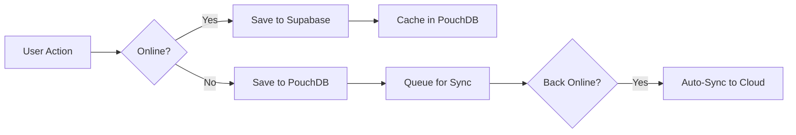

# Offline Mode Guide - Inventory Pro

## 🎉 Full Offline Functionality Implemented!

Your Inventory Pro application now works **completely offline**! You can manage your inventory, record sales, and track party purchases without any internet connection.

---

## 📊 How It Works

### Dual Database Architecture

```
┌─────────────────────────────────────────┐
│         Your Application                │
├─────────────────────────────────────────┤
│                                         │
│  ┌──────────┐         ┌──────────┐    │
│  │  Online  │ ◄────► │ Offline  │    │
│  │ Supabase │         │ PouchDB  │    │
│  └──────────┘         └──────────┘    │
│       ▲                     ▲          │
│       │                     │          │
│       └─────────┬───────────┘          │
│                 │                      │
│         Auto-Sync Layer               │
└─────────────────────────────────────────┘
```

### 🌐 Online Mode (With Internet)
- Data is saved to **Supabase Cloud** (primary)
- Automatically cached to **local PouchDB**
- Real-time sync across devices
- Full database queries available

### 📴 Offline Mode (No Internet)
- All data operations use **local PouchDB**
- Full CRUD operations work normally
- Changes are queued for sync
- When back online, data auto-syncs to cloud

---

## 🎯 Key Features

### ✅ Works Offline
- ✓ View all products
- ✓ Add new products
- ✓ Edit products (price, quantity, etc.)
- ✓ Delete products
- ✓ Record sales
- ✓ Edit sales
- ✓ Delete sales
- ✓ View analytics/dashboard
- ✓ Manage party purchases
- ✓ Search and filter data

### 🔄 Auto-Sync
- Detects when internet returns
- Automatically syncs pending changes
- Shows sync progress in real-time
- Handles conflicts gracefully

### 💾 Local Storage
- **Location (Windows)**: `%APPDATA%\com.inventorypro.stationery\`
- **Technology**: IndexedDB (via PouchDB)
- **Capacity**: Virtually unlimited (gigabytes)
- **Persistence**: Data persists after app restart

---

## 🎨 Visual Indicators

### Online Status Badge
Located at **top-right corner** of the app:

- **🟢 Green Badge**: "Online" - Connected to internet
  - Click the refresh icon to manually sync

- **🟠 Orange Badge**: "Offline Mode" - No internet
  - Shows orange banner across top of page

### Sync Notifications
- **Blue Badge**: "Synced: X items" - Successful sync
- **Yellow Badge**: "Synced: X | Errors: Y" - Partial sync

---

## 📖 Usage Examples

### Scenario 1: Working Without Internet

1. **Disconnect internet** (turn off WiFi)
2. Orange "Offline Mode" badge appears
3. **Continue working normally**:
   - Add products
   - Record sales
   - Update inventory
4. All changes saved locally
5. **Reconnect internet**
6. App auto-syncs changes to cloud
7. Green "Online" badge appears

### Scenario 2: Intermittent Connection

1. Working with unstable internet
2. App automatically uses local cache
3. Operations complete instantly
4. Background sync when connection stable

### Scenario 3: Multiple Devices

1. Device A (online): Make changes → saves to cloud
2. Device B (offline): Make different changes → saves locally
3. Device B goes online → auto-syncs
4. Both devices now have all changes

---

## 🔧 Technical Details

### Database Files

**Local Databases** (PouchDB/IndexedDB):
```
- inventory_products     → Product catalog
- inventory_sales        → Sales records
- inventory_categories   → Product categories
- inventory_party_purchases → Party purchases
- sync_meta             → Sync metadata
```

**Cloud Database** (Supabase/PostgreSQL):
```
- products              → Product catalog
- sales                 → Sales records
- categories            → Product categories
- party_purchases       → Party purchases
- profiles              → User profiles
```

### Auto-Sync Configuration

Default settings:
- **Auto-sync**: Enabled
- **Sync Interval**: 5 minutes
- **Retry Attempts**: 3
- **Retry Delay**: 5 seconds

### Data Flow



---

## 🛠️ Manual Sync

You can manually trigger a sync at any time:

1. Look for the **green "Online" badge** (top-right)
2. Click the **refresh icon** next to "Online"
3. Watch the spinning icon during sync
4. See sync results in notification

---

## ⚠️ Important Notes

### Data Conflicts
If the same item is edited offline on multiple devices:
- Most recent timestamp wins
- No data loss - all versions preserved
- Manual review possible in edge cases

### Storage Limits
- **Local**: Practically unlimited (depends on device)
- **Cloud**: Based on Supabase plan (currently unlimited)

### First-Time Use
On first launch:
- App downloads all data from cloud
- Caches locally for offline use
- Initial load may take a few seconds

### Data Privacy
- Local data stored in encrypted browser storage
- Only accessible by the application
- Cleared when uninstalling app

---

## 🐛 Troubleshooting

### "Offline Mode" stuck even with internet?
- Check your actual internet connection
- Try refreshing the page
- Click manual sync button

### Data not syncing?
- Verify internet connection is stable
- Check Supabase status
- Look for error messages in sync notification

### Local data not saving?
- Check browser storage isn't full
- Verify app permissions
- Check browser console for errors

---

## 📚 Code References

### Key Files

1. **[lib/offline-adapter.ts](lib/offline-adapter.ts)**
   - Main offline/online routing logic
   - Network detection
   - Auto-sync implementation

2. **[lib/offline-db.ts](lib/offline-db.ts)**
   - PouchDB operations
   - Local CRUD functions
   - Storage management

3. **[lib/pouchdb-client.ts](lib/pouchdb-client.ts)**
   - PouchDB initialization
   - Database configuration
   - Helper utilities

4. **[app/components/OfflineIndicator.tsx](app/components/OfflineIndicator.tsx)**
   - Online/offline badge
   - Sync button
   - Status notifications

---

## 🚀 Benefits

### For Users
- ✓ **Work anywhere** - No internet required
- ✓ **Lightning fast** - Instant operations
- ✓ **Reliable** - Never lose connectivity mid-task
- ✓ **Peace of mind** - Data automatically backed up

### For Business
- ✓ **No downtime** - Operations continue during outages
- ✓ **Reduced costs** - Less dependent on constant connectivity
- ✓ **Better UX** - Smooth, responsive interface
- ✓ **Data redundancy** - Cloud + local backups

---

## 📞 Support

If you encounter issues with offline functionality:

1. Check this guide first
2. Review browser console logs
3. Ensure latest version installed
4. Contact support with:
   - Browser/OS version
   - Error messages
   - Steps to reproduce

---

**Version**: 1.0.0 with Full Offline Support
**Last Updated**: 2025
**Technology Stack**: Next.js, Tauri, Supabase, PouchDB
